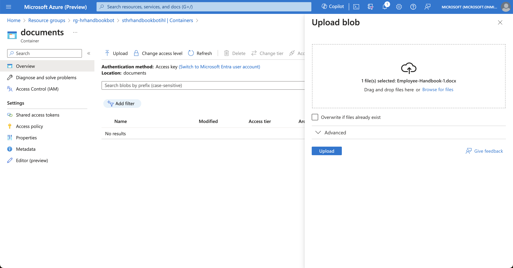
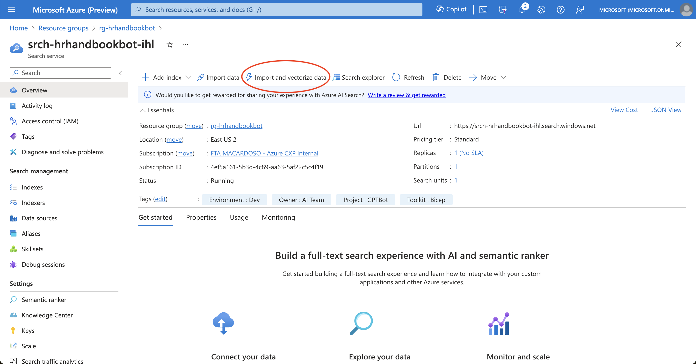

# AI Search Retrieval-augmented generation

Deploy an assistant that can search an Azure AI Search index to respond to questions.
This sample will consider a sample HR Handbook.

## Sample questions

- Can you give me information about PTO?
- Are my messages transmitted using company software private?
- How is equal opportunity employment defined?

## Recommended deployment parameters

To deploy this solution, use the [Semantic Kernel Bot in-a-box](../README.md) accelerator with the following parameters:

    Azure location = East US 2
    gptModel = gpt-4
    gptVersion = 1106-preview
    deploySearch = true
    publicNetworkAccess = true

## Additional steps

In addition to deploying the sample, You will need to configure the documents and search index to be used by the bot. Follow the steps below to do this:

- Go to the Storage Account created as part of the deployment and add a container.

- Drop any files you would like to be searched by the bot into the container. Supported file formats include. It is recommended to start with PDF, DOCX or PPTX. A great example to quickly validate the solution is an HR Handbook template, which can be easily found online.

- Go to your Azure AI Search resource and use the Import and Vectorize data feature. It will take care of the entire process of chunking, vectorizing and adding each document in the blob storage container to your search index.

- Back to App Services, add the relevant environment variables:
    - **SEARCH_INDEX**: The name of the search index created.
    - **SEARCH_SEMANTIC_CONFIG**: The name of the semantic configuration created. You can locate this value by going to Indexes -> Selec your index -> Semantic Configurations
- (Optional) To enable linked citations:
    - Go to the created Index and add a "path" field, with the Retrievable option enabled.
    - Go to the created Indexer's JSON definition and add a field mapping to the path field

            "fieldMappings": [
                {
                    "sourceFieldName": "metadata_storage_name",
                    "targetFieldName": "title",
                    "mappingFunction": null
                },
                {
                    "sourceFieldName": "metadata_storage_path",
                    "targetFieldName": "path",
                    "mappingFunction": null
                }
            ],

    - Go to the created Skillset and add a mapping to the "path" field

            "indexProjections": {
                "selectors": [
                {
                    "targetIndexName": "vector-1705514319324",
                    "parentKeyFieldName": "parent_id",
                    "sourceContext": "/document/pages/*",
                    "mappings": [
                    {
                        "name": "chunk",
                        "source": "/document/pages/*",
                        "sourceContext": null,
                        "inputs": []
                    },
                    {
                        "name": "vector",
                        "source": "/document/pages/*/vector",
                        "sourceContext": null,
                        "inputs": []
                    },
                    {
                        "name": "title",
                        "source": "/document/metadata_storage_name",
                        "sourceContext": null,
                        "inputs": []
                    },
                    {
                        "name": "path",
                        "source": "/document/path",
                        "sourceContext": null,
                        "inputs": []
                    }
                    ]
                }
                ],
                "parameters": {
                "projectionMode": "skipIndexingParentDocuments"
                }
            },
            ...

## Deployment validation

Ask the sample questions to verify that the deployment was successful:

## Customization steps

Once the sample is deployed, you will likely want to connect the assistant to your own document collection. To do this, simply add any other documents you would like added to the bot and re-run the indexing process.